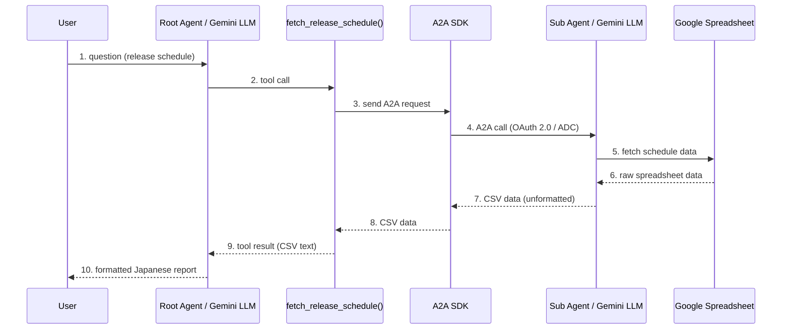
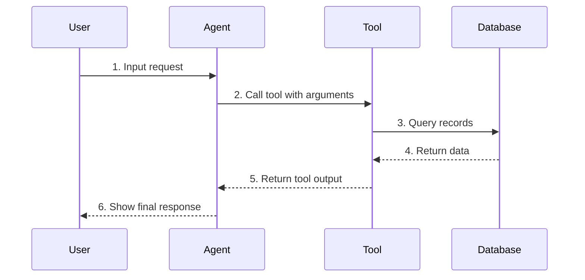

## はじめに

技術プレゼンでシーケンス図を作るとき、こんな経験はないでしょうか：

- Mermaid（標準の記法）で書いたら文字切れが発生
- AIに「図を描いて」と言ったら、毎回色もレイアウトもバラバラ
- 結局 PowerPoint で手書き…

この記事では、**Antigravity（Google のエージェント型 AI 開発環境）** の **Workflow** と **Skill** を使って、Mermaid コードからプレゼン品質のシーケンス図を **安定して** 生成する方法を紹介します。

## 動作環境

本記事の解説および動作検証は、以下の環境で行っています。

*   **開発環境**: **Antigravity IDE Version 2.0.3+ (V2+)**
*   **動作ホスト**: Linux (WSL2: Ubuntu)
    *   Antigravity は Windows / macOS / Linux に対応しているため、他OSでも同様に動作可能ですが、本手順は Linux/WSL2 上で検証されています。
*   **Node.js**: v18以上 (パッケージ管理: npm)
*   **画像生成**: ビルトイン `generate_image` ツール (nanobananaモデル)

:::message alert
**⚠️ グローバルパスに関する注意**
公式ドキュメント等ではグローバルスコープの配置先として `~/.gemini/antigravity/`（例: `~/.gemini/antigravity/skills/`）が記載されている場合がありますが、本記事で動作検証を行っている **Antigravity IDE V2 / Version 2.0.3+** の環境では、グローバルな設定やカスタム Workflow / Skill のアセットが `~/.gemini/config/` 配下に集約される仕様となっています。古いバージョンなど、お使いの環境の仕様に合わせて、適宜 `~/.gemini/antigravity/` 等にパスを読み替えて配置を行ってください。
:::

Workflow × Skill の設計パターン自体は GitHub Copilot や Claude Code 等にも応用可能です。画像生成については、Antigravity ではビルトインの `generate_image` がそのまま使用可能ですが、他のツールでも [MCP 経由の画像生成サーバー](https://zenn.dev/forward/articles/11a680c4b530ab)などを利用すれば同様のアプローチを実現できます。

## 導入前後の比較（Before / After）

まず結果から。同じ Mermaid コードから生成した図を比較します。

### 導入前：Mermaidの標準出力による直接描画


**問題点:**
- パーティシパント名が長いと **文字切れ** が発生
- 色は全パーティシパントで **同一テーマ** （個別指定不可）
- レンダリング環境に品質が依存

### 導入後：Workflow × Skill による安定生成


**改善点:**
- ✅ ドメイン別の **意味的な配色** で構造が一目瞭然
- ✅ 同じ Workflow を使えば **誰でも同じ品質** で再現可能

---

## アーキテクチャ: Workflow と Skill の洗練された分離

今回の肝は、プロセスを制御する **Workflow（手順書）** と、専門的な知識・アセットを持つ **Skill（能力・知識）** を徹底的に分離し、さらに Skill を「Mermaidの構文生成」と「ビジュアルレンダリング」の2つに分解したことです。

Antigravity の **Workflow** と **Skill** には、それぞれ適用範囲に応じて「ワークスペース単位」と「グローバル単位」の2種類のスコープ（インストール先）が存在します。用途に合わせて適切なディレクトリに配置します。

### ワークスペース単位（Workspace Scope）
特定のプロジェクト（Gitリポジトリ等）の文脈でのみ有効な、カスタム手順や特有のドメイン知識をAIエージェントに与えたい場合に使用します。プロジェクトごとの開発フローや独自のルール、チーム内共有のコーディング規約を定義するのに最適です。
*   **Workflowの配置先**: `<your-project-root>/.agent/workflows/`
*   **Skillの配置先**: `<your-project-root>/.agent/skills/`

### グローバル単位（Global Scope）
ユーザーのホームディレクトリ配下に配置され、すべてのプロジェクトやワークスペースで共通して使える汎用的なカスタム手順や共通の能力を定義する場合に使用します。どのプロジェクトを開いていても同じコマンド（スラッシュコマンド）やスタイル定義を適用できます。
*   **Workflowの配置先**: `~/.gemini/config/global_workflows/`
*   **Skillの配置先**: `~/.gemini/config/skills/`

今回はどのプロジェクトでも再利用できるように、すべて **グローバルスコープ** に配置しています。

```
~/.gemini/config/
├── global_workflows/          ← 「手順の制御（Orchestration）」
│   └── create-diagram.md      ← /create-diagram: 作成から画像化までを一元管理
│
└── skills/                    ← 「専門知識・アセット（Capability）」
    ├── mermaid-generation/    ← 1. 高品質なMermaidコードを書くための文法制約
    │   └── SKILL.md
    │
    └── diagram-rendering/     ← 2. フラットデザイン・配色ルール・参考画像
        ├── SKILL.md
        └── examples/
            └── sequence_reference.png
```

### なぜ1つのWorkflowと2つのSkillに分けるのか？

| コンポーネント | 役割 | 分離するメリット |
|:---|:---|:---|
| **Workflow** (`create-diagram`) | 全体の対話プロセス制御<br>（要件整理 ➔ レビュー ➔ レンダリング） | ユーザーは `/create-diagram` コマンドを1度叩くだけでよく、スマートな対話型UI（UX）を提供できる。 |
| **Skill 1** (`mermaid-generation`) | バグのない Mermaid コード生成のルール<br>（エイリアス使用、英語表記等） | Mermaid 構文の専門知識が Workflow から隠蔽され、コード文書化等の別の Workflow でも簡単に再利用できる。 |
| **Skill 2** (`diagram-rendering`) | プレゼン向けデザインのガイドライン<br>（ドメイン配色、`generate_image` 用プロンプト） | グラフィック表現のノウハウが独立し、既存の Mermaid コードを一括画像化する別の Workflow などで再利用できる。 |

---

## 統合された対話型 Workflow

`/create-diagram` コマンドを1回実行するだけで、人間の確認（Human-in-the-loop）を挟みながら、スムーズにシーケンス図画像が完成します。

### ステップ 1: 要件定義から Mermaid コードの自動作成

ユーザーから要件を受け取り、`mermaid-generation` スキルを活用して、最適な Mermaid コードを作成して提示します。

**実行例:**

```
/create-diagram
以下の概要からシーケンス図を生成してください。
ルートエージェントはユーザーの質問を受け、ツール関数内から A2A SDK でサブエージェントを呼び出し...
```

**出力:**



### ステップ 2: ユーザーレビューと承認

エージェントは Mermaid コードと技術的なフロー解説を提示し、ユーザーに「この内容で画像化を進めてよいか」を確認します。ユーザーは必要に応じて「ステップ3のメッセージを修正して」などとフィードバックできます。

### ステップ 3: スタイリッシュな画像生成の自動実行

ユーザーから「OK」または「進めて」の承認が得られたら、エージェントは `diagram-rendering` スキルを自動適用し、構造化されたプロンプトを作成します。さらに、`examples/sequence_reference.png` を参照画像（ImagePaths）として `generate_image` ツールに渡し、プレゼン品質の画像を生成します。

:::message
**`generate_image` とは？**
Antigravity のエージェントが使える画像生成ツールです。内部では Google の画像生成モデル **nanobanana** が自動で呼び出されます。ユーザーやワークフローがテキストプロンプトを渡すだけで、nanobanana がプレゼン品質の画像を生成してくれます。ブラウザや外部ツールのセットアップは一切不要です。
:::

---

## Skill: ドメイン別配色

配色で最も重要な設計判断は、**「交互に色を変える」のではなく「論理的なドメインごとに色を割り当てる」** ことです。これを `diagram-rendering` スキルに登録しておきます。

| ドメイン | 色 | 対象例 |
|:--|:--|:--|
| 🔘 User | `#6B7280` (gray) | エンドユーザー |
| 🔵 Root Agent | `#1E3A5F` (navy) | ルート LLM、ツール関数 |
| 🟢 Middleware | `#0F766E` (teal) | A2A SDK、通信層 |
| 🟣 Sub Agent | `#6B4C9A` (purple) | サブ LLM |
| 🌲 External | `#2D6A4F` (green) | スプレッドシート、DB |

### 分類の考え方
新しいパーティシパントが出てきたら、5つの質問で自動分類させます:
1. 人間か？ → **Gray**
2. メインエージェントの一部か？ → **Navy**
3. 通信・プロトコル層か？ → **Teal**
4. サブエージェントか？ → **Purple**
5. 外部データソースか？ → **Green**

---

## 設定ファイルの全コード

以下の3つのファイルを `~/.gemini/config/` に配置することで、この美しい設計パターンを再現できます。

### 1. Workflow: `/create-diagram`

:::details create-diagram.md のコードを見る

```markdown
---
description: 技術トピックからシーケンス図を作成し、プレゼン用の高品質なPNG画像にレンダリングする一連のプロセスを実行する
---

# シーケンス図クリエイター

ユーザーの要望に基づいて技術的な流れを整理し、正確な Mermaid `sequenceDiagram` を作成した後、承認を得てプレゼン用の高品質なPNG画像としてレンダリングします。

## 前提条件
- `mermaid-generation` スキルを活用して Mermaid コードを最適化すること
- `diagram-rendering` スキルを活用してビジュアルおよび配色を決定すること

## ステップ

### 1. 技術要件の整理とMermaidコード生成
- ユーザーの要望を分析し、必要に応じて `search_web` や MCP ツールで技術仕様を調査します。
- `skills/mermaid-generation/SKILL.md` の記述ルールとベストプラクティスに従い、厳密な Mermaid `sequenceDiagram` コードを作成します。
- 作成した Mermaid コードと、登場人物・処理シーケンスの箇条書きによる簡潔な解説を提示します。

### 2. ユーザーのレビューと承認
- 提示した Mermaid コードのフローが要件を満たしているか、ユーザーのレビューと修正の有無を確認します。
- **必ずユーザーの明示的な承認を得てから** 次のステップ（画像生成）に進みます。

### 3. スタイリッシュな画像レンダリングの実行
- ユーザーから承認された Mermaid コードを、`skills/diagram-rendering/SKILL.md` のガイドラインに従ってプロンプトに変換します。
- 参加者の役割に応じたドメイン配色ルール（User/Root Agent/Middleware/Sub Agent/External Data）を厳密に適用します。
- テンプレートに従って構造化された画像生成プロンプトを作成し、`generate_image` を呼び出して PNG 画像を生成します。
- `diagram-rendering` スキルの `examples/` に格納されている参考画像（`sequence_reference.png`）を `ImagePaths` に含めて参照させ、デザインのトーン＆マナーを統一します。

### 4. 成果物の納品と最終確認
- 生成された画像（PNG）を表示し、Mermaid ソースコードを併記します。
- 画像内の文字切れ、色の割り当て、メッセージの流れに問題がないか最終チェックを行い、ユーザーに確認します。
```

:::

### 2. Skill 1: `mermaid-generation`

:::details mermaid-generation/SKILL.md のコードを見る

```markdown
---
name: mermaid-generation
description: Rules and guidelines for generating clean, error-free Mermaid sequence diagrams optimized for processing.
---

# Mermaid Generation Skill

このスキルは、バグがなく読みやすい Mermaid `sequenceDiagram` コードを生成するためのベストプラクティスを定義します。

## 構文規則とベストプラクティス

1. **`sequenceDiagram` 型のみを使用**:
   他のダイアグラムタイプは使用せず、必ず `sequenceDiagram` で開始してください。

2. **参加者（Participant）には必ずエイリアスを使用**:
   ダイアグラムの見通しを良くし、プロンプト化しやすくするため、短いエイリアスを定義します。
   - 例: `participant U as User`
   - 例: `participant R as Root Agent`

3. **日本語ラベルは原則避け、英語で記述する**:
   レンダリングエンジンや画像生成モデルでの文字化けやレイアウト崩れを防ぐため、パーティシパント名およびメッセージラベルは基本的に英語で記述します（必要に応じて、説明テキスト部で日本語の解説を補足します）。

4. **メッセージラベルにステップ番号を付与する**:
   フローの順序を明確にするため、メッセージテキストの先頭に必ず通し番号を振ります。
   - 例: `U->>R: 1. send query`
   - 例: `R->>F: 2. call function`

5. **矢印のセマンティクスを統一する**:
   - **同期/非同期リクエスト（実線）**: `->>`（実線矢印）
   - **レスポンス/リターン（破線）**: `-->>`（破線矢印）

6. **制御フローの明記**:
   必要に応じて `alt`/`else` や `loop` などの制御ブロックを適切に使用し、複雑な条件分岐や繰り返し処理を明確に表現します。

## 生成コードの例


```

:::

### 3. Skill 2: `diagram-rendering`

:::details diagram-rendering/SKILL.md のコードを見る

```markdown
---
name: diagram-rendering
description: Color schemes and styling guidelines for converting Mermaid sequence diagrams into professional presentation-grade slides using image generation.
---

# Diagram Rendering Skill

このスキルは、Mermaid `sequenceDiagram` のテキスト構造を解釈し、`generate_image` を使用してプレゼンテーションに耐えうる美しいビジュアル（PNG画像）へと変換するためのスタイルガイドです。

## セマンティック・ドメイン配色ルール

図全体の視覚的なまとまりと「一目でわかる構造」を実現するため、色は機械的に交互に変えるのではなく、**コンポーネントが属する役割（ドメイン）ごとに配色を割り当てます**。

| ドメイン (Domain) | 背景色 (Fill Color) | 文字色 (Text Color) | 対象例 |
|:---|:---|:---|:---|
| **User** | `#6B7280` (Medium Gray) | `#FFFFFF` | エンドユーザー、人間のオペレーター |
| **Root Agent** | `#1E3A5F` (Dark Navy) | `#FFFFFF` | ルート LLM、オーケストレーター、ツール関数 |
| **Middleware** | `#0F766E` (Teal) | `#FFFFFF` | 通信プロトコル、A2A SDK、APIゲートウェイ |
| **Sub Agent** | `#6B4C9A` (Muted Purple) | `#FFFFFF` | サブ LLM、特化型子エージェント |
| **External Data** | `#2D6A4F` (Forest Green) | `#FFFFFF` | データベース、スプレッドシート、外部API |

### 分類判断フロー
新しいコンポーネントをどのドメインに割り当てるかは、以下の優先度で判断します：
1. 人間または外部アクターか？ ➔ **User (Gray)**
2. システム全体の制御を行うメインシステムか？ ➔ **Root Agent (Navy)**
3. 中継・通信・認証などを担当する層か？ ➔ **Middleware (Teal)**
4. メインから呼び出されるAIエージェントか？ ➔ **Sub Agent (Purple)**
5. データの永続化や外部システムか？ ➔ **External Data (Green)**

## ビジュアルデザインの原則

- **白背景 (White Background)**: スライドに貼り付けやすくするため、背景は必ず純粋な白（#FFFFFF）とします。
- **フラットデザイン (Flat Minimalist Style)**: グラデーション、3D効果、派手な影（Shadows）は避け、クリーンな2Dベクトルイラスト風にします。
- **フォント**: すっきりとしたサンセリフ（Sans-serif）書体を指定します。
- **レイアウト**:
  - 各パーティシパントは上部に角丸の四角形（Rounded corner boxes）で配置。
  - 下方向へ点線のライフライン（Dashed vertical lifelines）を伸ばす。
  - メッセージは実線/破線の矢印で水平に引き、その直上にダークグレー（#333333）のテキストでステップ番号とラベルを配置。
- **テキスト内の色コード表示の禁止 (No HEX code text)**: 各ボックス of ラベルには参加者の名前のみを記述し、**背景色指定のためのカラーコード（例: #1E3A5F）や色名（例: Navy）をテキストとして描画してはいけません**（画像生成モデルがHEX値そのものを文字としてレンダリングするのを防ぐため）。

## プロンプト組み立てテンプレート

`generate_image` を実行する際は、以下の構造でプロンプトを構成します。

```text
Professional presentation-grade sequence diagram, flat vector illustration style, minimal and clean design.
Background: Pure white (#FFFFFF). No shadows, no gradients, no 3D effects. High contrast.

Participants (boxes at the top with dashed vertical lifelines going down):
- [Participant A Name]: Rounded box with a solid background colored in [Color HEX] ([Color Name]). Inside the box, render ONLY the text "[Participant A Name]" in white. Do NOT write the color HEX code or color name as text inside the box.
- [Participant B Name]: Rounded box with a solid background colored in [Color HEX] ([Color Name]). Inside the box, render ONLY the text "[Participant B Name]" in white. Do NOT write the color HEX code or color name as text inside the box.

Messages (horizontal arrows between lifelines with labels above them in dark gray sans-serif font #333333):
- Step 1: [Participant A] to [Participant B], solid arrow with label "1. [Message Label]"
- Step 2: [Participant B] to [Participant C], solid arrow with label "2. [Message Label]"
- Step 3: [Participant C] to [Participant B], dashed arrow with label "3. [Message Label]"
```
```
```

:::

---

## 3つの大きな改善ポイント

今回のリファクタリング（設計見直し）で得られた知見をまとめます。

### 1. ユーザーを二度手間から解放する「単一対話型 Workflow」
当初は「Mermaidコード生成」と「画像レンダリング」で別々のWorkflowを定義していましたが、ユーザーが何度もコマンドを実行する必要があり不便でした。
1つの統合された `/create-diagram` Workflowにまとめ、対話の過程でユーザーの明示的な承認を待つ構造にしたことで、スマートでシームレスな対話型UXが実現しました。

### 2. 「LLMの論理」と「デザイナーの意図」の完全な分離
- Mermaid の文法知識（エイリアス指定、英語表記への統一など）は **`mermaid-generation`** Skill へカプセル化。
- 出力されるビジュアルのデザインガイド（ドメイン配色、フラット化ルールなど）は **`diagram-rendering`** Skill へカプセル化。
これにより、「ダイアグラムのロジック」と「グラフィック表現」が綺麗に分離され、それぞれのスキルが別の場面でも汎用的に使い回せるようになりました。

### 3. 参考画像（examples/）による画像品質のさらなる安定化
`generate_image` （nanobanana）を実行する際、`diagram-rendering` の `examples/sequence_reference.png` （実績のある過去の出力画像）をインプット（`ImagePaths`）として与えることで、生成モデルが配置のルールや余白、文字の位置などを正確に真似しやすくなり、毎回高品質な画像がブレずに生成されるようになりました。

---

## まとめ

| 手法 | 一貫性 | 再現性 | 環境非依存 | ユーザーUX |
|:--|:--:|:--:|:--:|:--:|
| 手動（PowerPoint等） | ✅ | ❌ | ✅ | ❌ |
| Mermaid標準機能での直接出力 | ❌ | ✅ | ❌ | 🔺 |
| AI に都度プロンプト指示 | ❌ | ❌ | ✅ | 🔺 |
| **統合型 Workflow × Skill** | **✅** | **✅** | **✅** | **✅** |

単に AI に「描いて」とお願いするだけではなく、**「プロセスは Workflow で対話的に統合し、専門知識は役割ごとに Skill へきれいに分離する」**。これこそが、Antigravity などの先進的なエージェント環境を最大限に活かすベストプラクティスです。ぜひ日々の技術発信や資料作成にお役立てください！

---

## 参考リンク

*   [AgentSkills.io — エージェントスキルの共有プラットフォーム](https://agentskills.io/)
*   [Antigravity Docs](https://antigravity.google/docs/getting-started)
*   [Skills ドキュメント](https://antigravity.google/docs/skills)
*   [MCP ドキュメント](https://antigravity.google/docs/mcp)
*   [【Claude Codeから画像生成】画像生成MCPを作ってnpmに公開した](https://zenn.dev/forward/articles/11a680c4b530ab)
