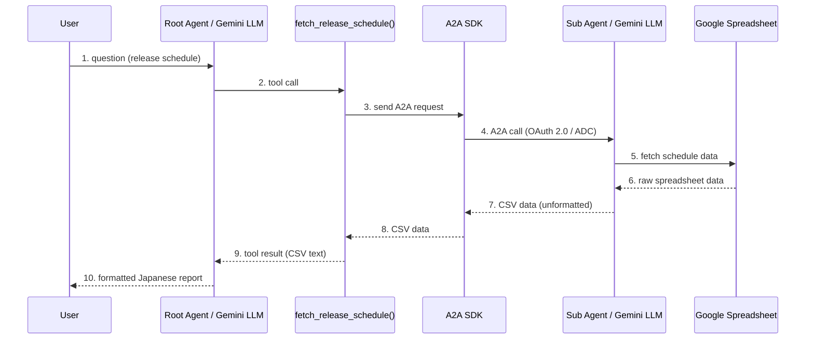

## はじめに

技術プレゼンでシーケンス図を作るとき、こんな経験はないでしょうか：

- Mermaid.js で書いたら文字切れが発生
- AIに「図を描いて」と言ったら、毎回色もレイアウトもバラバラ
- 結局 PowerPoint で手書き…

この記事では、**Antigravity（Google のエージェント型 AI 開発環境）** の **Workflow** と **Skill** を使って、Mermaid コードからプレゼン品質のシーケンス図を **安定して** 生成する方法を紹介します。

:::message alert
**実行環境**: 本記事は Linux（WSL2）環境で動作確認しています。Antigravity は Windows / macOS / Linux に対応しているため、他の OS でも同様の手順で再現可能と思われますが、未検証です。
Workflow × Skill の設計パターン自体は GitHub Copilot や Claude Code 等にも応用できます。画像生成については、Antigravity ではビルトインの `generate_image`（nanobanana）が使えますが、他のツールでも [MCP 経由の画像生成サーバー](https://zenn.dev/forward/articles/11a680c4b530ab)を利用すれば同様のアプローチが可能です。
:::

## Before / After

まず結果から。同じ Mermaid コードから生成した図を比較します。

### Before: Mermaid.js 直接レンダリング


**問題点:**
- パーティシパント名が長いと **文字切れ** が発生
- 色は全パーティシパントで **同一テーマ** （個別指定不可）
- レンダリング環境に品質が依存

### After: Workflow × Skill で生成


**改善点:**
- ✅ 文字切れなし（テキスト記述からの生成なので物理的制約がない）
- ✅ ドメイン別の **意味的な配色** で構造が一目瞭然
- ✅ 同じ Workflow を使えば **誰でも同じ品質** で再現可能

---

## アーキテクチャ: Workflow × Skill の分離

今回の肝は、**Workflow（手順書）** と **Skill（スタイルガイド）** を分離したことです。

Antigravity の Skill には **ワークスペーススコープ**（`.agent/skills/`）と **グローバルスコープ**（`~/.gemini/antigravity/skills/`）の2種類があります。今回はどのプロジェクトでも使えるように **グローバルスコープ** に配置しています。

```
~/.gemini/antigravity/
├── global_workflows/          ← 「何をするか」（手順）
│   ├── diagram.md             ← /diagram: Mermaidコード作成
│   └── diagram-render.md      ← /diagram-render: 画像生成
│
└── skills/                    ← 「どうやるか」（知識・資材）
    └── diagram-design/
        ├── SKILL.md            ← 配色ルール・プロンプトテンプレート
        └── examples/           ← 参考画像
            └── sequence_reference.png
```

Skill のディレクトリ構造は[公式ドキュメント](https://antigravity.google/docs/skills)で以下のように定義されています：

```
.agent/skills/my-skill/
├── SKILL.md       # Main instructions (required)
├── scripts/       # Helper scripts (optional)
├── examples/      # Reference implementations (optional)
└── resources/     # Templates and other assets (optional)
```

今回は `examples/` に参考画像を格納し、`generate_image` 実行時に `ImagePaths` として渡すことで出力品質を安定させています。

### なぜ分けるのか？

| | Workflow だけ | Workflow + Skill |
|:--|:--|:--|
| 配色の一貫性 | ❌ 毎回プロンプトに書く | ✅ Skill に定義、自動参照 |
| 参考画像 | ❌ 置き場所なし | ✅ `examples/` に格納 |
| 別の図でも再利用 | ❌ コピペが必要 | ✅ 同じ Skill を参照 |
| メンテナンス | ❌ Workflow が肥大化 | ✅ 関心の分離 |

:::message
**参考リンク**
- [Antigravity 公式サイト](https://antigravity.google)
- [Skills ドキュメント](https://antigravity.google/docs/skills)
- [Workflows ドキュメント](https://antigravity.google/docs/workflows)
- [【Claude Codeから画像生成】画像生成MCPを作ってnpmに公開した](https://zenn.dev/forward/articles/11a680c4b530ab)
:::

---

## 2段階 Workflow

### ステップ 1: `/diagram` — Mermaid コード作成

ユーザーの要件から Mermaid `sequenceDiagram` コードを作成します。

**実行例:**

```
/diagram
以下の概要からシーケンス図を生成してください。
ルートエージェントはユーザーの質問を受け、ツール関数内から A2A SDK でサブエージェントを呼び出し...
```

**出力（Mermaid コード）:**



:::message
`/diagram` は Mermaid コードの作成のみ。画像は生成しません。ユーザーの承認を得てから次のステップに進みます。
:::

### ステップ 2: `/diagram-render` — 画像生成

承認済みの Mermaid コードから画像を生成します。

**ここが今回の核心です。** Mermaid コードを直接レンダリングするのではなく、**テキスト記述として `generate_image` に渡します**。

:::message
**`generate_image` とは？**
Antigravity のエージェントが使える画像生成ツールです。内部では Google の画像生成モデル **nanobanana** が自動で呼び出されます。ユーザーやワークフローがテキストプロンプトを渡すだけで、nanobanana がプレゼン品質の画像を生成してくれます。ブラウザや外部ツールのセットアップは一切不要です。
:::

```
/diagram-render
```

内部では以下が起きます:

1. Mermaid コードからパーティシパントとメッセージを抽出
2. **Skill の配色ルール** に従ってドメイン分類
3. 構造化されたテキストプロンプトを組み立て
4. `generate_image` で画像を生成

---

## Skill: ドメイン別配色

配色で最も重要な設計判断は、**交互に色を変える** のではなく **論理的なドメインごとに色を割り当てる** ことです。

| ドメイン | 色 | 対象例 |
|:--|:--|:--|
| 🔘 User | `#6B7280` (gray) | エンドユーザー |
| 🔵 Root Agent | `#1E3A5F` (navy) | ルート LLM、ツール関数 |
| 🟢 Middleware | `#0F766E` (teal) | A2A SDK、通信層 |
| 🟣 Sub Agent | `#6B4C9A` (purple) | サブ LLM |
| 🌲 External | `#2D6A4F` (green) | スプレッドシート、DB |

この配色テーブルを Skill の `SKILL.md` に定義しておくことで、AI は新しい図を描くときも同じ配色ルールを自動適用します。

### 分類の考え方

新しいパーティシパントが出てきたら、5つの質問で分類します:

1. 人間か？ → **Gray**
2. メインエージェントの一部か？ → **Navy**
3. 通信・プロトコル層か？ → **Teal**
4. サブエージェントか？ → **Purple**
5. 外部データソースか？ → **Green**

---

## 再現方法

以下のファイルを `~/.gemini/antigravity/` に配置すれば、同じ仕組みを再現できます。

### Workflow: `/diagram`（Mermaid コード作成）

:::details diagram.md のコードを見る

```markdown
---
description: 技術トピックを調査し、プレゼン用のMermaidシーケンス図コードを作成してユーザーレビューを受ける
---

# シーケンス図デザイナー

公式ドキュメントを調査し、正確な Mermaid sequenceDiagram コードブロックを作成してユーザーのレビューを受けます。

## ステップ

### 1. 公式情報の調査

- search_web や mcp_google-developer-knowledge_search_documents を使って、依頼されたトピックの公式ドキュメントを調査する
- ブログ記事よりも公式ドキュメント・RFC・仕様書を優先する
- ユーザーが「調査不要」や自分でまとめを提示した場合は、調査をスキップしてステップ2に進む

### 2. まとめとMermaidコードを提示

技術的なまとめとMermaidコードを1つのレスポンスにまとめて提示する:

まとめセクション:
- 登場人物（エンティティ）: すべてのアクター/コンポーネントの一覧
- フロー: 番号付きの処理手順
- 出典: 参照した公式ドキュメントのURL

Mermaidコードセクション:
- sequenceDiagram 型のみ使用
- ラベルはすべて英語で記述（日本語はレンダリング時に文字切れするため）
- participant にはエイリアスを使う（例: participant U as User）
- メッセージラベルには番号を振る（例: 1. question）
- リクエストには実線矢印(->>)、レスポンスには破線矢印(-->>)を使用

### 3. ユーザーに承認を求める

上記の内容とMermaidコードで画像生成に進んでよいか確認する。
OKであれば /diagram-render で画像化する。
```

:::

### Workflow: `/diagram-render`（画像生成）

:::details diagram-render.md のコードを見る

```markdown
---
description: Mermaidシーケンス図コードをプレゼン用の高品質PNG画像にレンダリングする
---

# シーケンス図レンダラー

Mermaid sequenceDiagram コードを、generate_image で直接プレゼン用の高品質PNG画像に変換します。

## 前提条件

- 会話中にMermaidコードが存在すること
- skills/diagram-design/SKILL.md のスタイルガイドに従うこと

## ステップ

### 1. Mermaidコードの解析と配色決定

1. パーティシパント一覧を抽出
2. メッセージ一覧を抽出（番号・ラベル・方向・送信元・送信先）
3. skills/diagram-design/SKILL.md のドメイン分類に従い配色を割り当て

### 2. generate_image でレンダリング

以下の構造でプロンプトを組み立てて実行する:

- Participants セクション: 名前と色を明示
- Messages セクション: 番号・ラベル・矢印の種類（実線/破線）・方向
- Style セクション: 白背景、フラットデザイン、サンセリフ書体

skills/diagram-design/examples/ に参考画像があれば ImagePaths に渡す。

### 3. 成果物を納品

1. 生成された画像を表示
2. Mermaidソースコードを併記
3. 修正の要否を確認
```

:::

### Skill: `diagram-design`（配色・スタイルガイド）

:::details SKILL.md のコードを見る

```markdown
---
name: diagram-design
description: Style guide and color scheme for generating professional sequence diagrams.
---

# Diagram Design Skill

## Color Scheme: Semantic Grouping

| Domain | Fill Color | Text Color | Usage |
|:--|:--|:--|:--|
| User | #6B7280 (gray) | #FFFFFF | End-user, human operator |
| Root Agent | #1E3A5F (dark navy) | #FFFFFF | Root LLM, tool functions |
| Middleware | #0F766E (teal) | #FFFFFF | A2A SDK, API gateways |
| Sub Agent | #6B4C9A (muted purple) | #FFFFFF | Sub LLM, sub agent tools |
| External Data | #2D6A4F (forest green) | #FFFFFF | Spreadsheets, databases |

## Visual Rules

- Rounded corner boxes for participant headers
- Dashed vertical lifelines
- Solid arrows for requests, dashed arrows for responses
- Arrow labels: dark gray (#333), sans-serif, above arrows
- Numbered steps on every message label
- White background, flat minimal vector style
- No shadows, no gradients, no 3D effects

## Applying Colors to New Diagrams

1. Is it a human/end-user? → Gray
2. Is it part of the root/primary agent? → Navy
3. Is it a communication bridge/protocol layer? → Teal
4. Is it part of a sub/secondary agent? → Purple
5. Is it an external data source or service? → Green
```

:::

---

## 3つの改善ポイント

今回の試行錯誤で得られた知見をまとめます。

### 1. Mermaid コードを「テキスト記述」として渡す

Mermaid.js で直接レンダリングすると、パーティシパント名が長い場合に文字切れが発生し、個別パーティシパントへの色指定もできません。

**Mermaid コードの構造をテキストで `generate_image` に渡す** ことで、これらの制約から解放されます。環境依存もゼロです。

### 2. 配色は「交互」ではなく「ドメイン別」

最初は navy と purple を交互に配置していましたが、6つのパーティシパントがあると「どれがどのグループか」が分かりにくくなります。

**ドメイン別のセマンティックカラー** にしたことで、「ルートエージェント領域」「サブエージェント領域」「通信層」が色だけで識別できるようになりました。

### 3. Workflow と Skill を分ければ品質が安定する

Workflow にスタイル情報を直接書くと：
- Workflow が肥大化する
- 別の図を描くときにコピペが必要
- 参考画像の置き場所がない

**Skill に分離** することで：
- 配色ルールは Skill に1箇所だけ定義
- 参考画像は `examples/` に格納
- 新しい Workflow からも同じ Skill を参照可能

---

## まとめ

| 手法 | 一貫性 | 再現性 | 環境非依存 |
|:--|:--:|:--:|:--:|
| 手動（PowerPoint等） | ✅ | ❌ | ✅ |
| Mermaid.js 直接 | ❌ | ✅ | ❌ |
| AI に都度お願い | ❌ | ❌ | ✅ |
| **Workflow × Skill** | **✅** | **✅** | **✅** |

AI にただ「図を描いて」とお願いするだけでは品質は安定しません。**Workflow で手順を定め、Skill でスタイルを定義する** ことで、誰が実行しても再現可能な品質が実現できます。

Antigravity の Workflow と Skill を使いこなすことで、プレゼン資料の作成がぐっと楽になります。ぜひ試してみてください。
